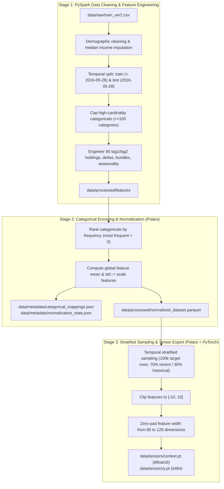

# TabDPT-reco: Santander Product Recommendation Pipeline

Data processing and feature engineering pipeline for tabular foundation models (specifically **TabDPT**) on the Santander Product Recommendation dataset.

The pipeline transforms raw multi-year transactional banking data into padded PyTorch tensors suitable for tabular deep learning transformers, constructing a **16-class product recommendation task** (Class 0 = do nothing, Classes 1..15 = specific product additions) with **80 high-signal predictive features**.

---

## Architecture & Directory Structure

```text
TabDPT-reco/
├── data/                               # All datasets & serialized metadata
│   ├── raw/                            # Original Santander CSVs & compressed archives
│   │   ├── train_ver2.csv              # ~2.29 GB raw historical training records
│   │   ├── test_ver2.csv               # ~110 MB raw test evaluation set
│   │   └── santander-product-recommendation.zip
│   ├── processed/                      # Parquet intermediate datasets across stages
│   │   ├── train_clean/                # Cleaned training partition (< 2016-05-28)
│   │   ├── test_may2016_clean/         # Cleaned evaluation test partition (2016-05-28)
│   │   ├── features/                   # Engineered lag, delta, bundle & seasonal features
│   │   └── normalized_dataset.parquet  # Fully encoded & globally standardized dataset
│   ├── metadata/                       # Encoding dictionaries & feature scaling stats
│   │   ├── categorical_mappings.json   # Frequency-ranked integer categorical mappings
│   │   └── normalization_stats.json    # Global feature mean and standard deviation
│   └── tensors/                        # Final exported PyTorch tensors for TabDPT
│       ├── context.pt                  # Padded feature matrix [N, 128], torch.bfloat16
│       └── y.pt                        # Target class vector [N], torch.int64
├── src/                                # Modular pipeline code
│   ├── config.py                       # Central path definitions & schema constants
│   ├── run_pipeline.py                 # Unified CLI runner for all stages
│   └── stages/                         # Pipeline stage implementations
│       ├── stage1_spark_features.py    # PySpark cleaning & feature engineering
│       ├── stage2_encode_normalize.py  # Categorical encoding & global normalization
│       └── stage3_tensor_builder.py    # Stratified subsampling & PyTorch tensor export
├── deploy_to_vast.ps1                  # Remote deployment automation script for Vast.ai
├── requirements.txt                    # Python dependencies
└── README.md
```

---

## Pipeline Stages



### Stage 1: `src/stages/stage1_spark_features.py`
- **Engine**: PySpark (local multi-threaded or cluster mode).
- **Functionality**:
  - Cleans raw demographic, account, and product columns.
  - Imputes missing household income by province median (falling back to global median).
  - Caps high-cardinality categoricals (`entry_channel` <= 80, `residence_country` <= 30) strictly on training data prior to May 2016 to prevent temporal leakage.
  - Generates lag 1 holdings for all 24 Santander products, and lag 2 / velocity deltas for core products.
  - Constructs 4 lifestyle bundles (`payroll`, `investment`, `credit`, `savings`).
  - Encodes calendar dynamics (`sin_month`, `cos_month`, tax, academic, summer, and pension season flags).
  - Builds the **16-class product recommendation target**:
    - `0`: Do nothing (no new product acquired).
    - `1..15`: Product added at time $t$ that was not held at time $t-1$.

### Stage 2: `src/stages/stage2_encode_normalize.py`
- **Engine**: Polars (high-performance columnar scanning).
- **Functionality**:
  - Scans `data/processed/features`.
  - Encodes categorical string and code features into frequency-ranked integer indices (index `0` for most frequent category) with safe fallbacks for unseen values.
  - Computes global dataset-level mean and standard deviation across all feature columns.
  - Scales features via z-score scaling: `(x - global_mean) / global_std`.
  - Saves metadata to `data/metadata/` and outputs `data/processed/normalized_dataset.parquet`.

### Stage 3: `src/stages/stage3_tensor_builder.py`
- **Engine**: Polars + PyTorch.
- **Functionality**:
  - Samples ~100,000 balanced rows with 70% recent (last 6 months) and 30% historical data across 6 strata:
    - 45k recent product purchases (Classes 1..15, 3k/class).
    - 15k historical product purchases (Classes 1..15, 1k/class).
    - 21k recent active non-purchases (Class 0).
    - 9k historical active non-purchases (Class 0).
    - 7k recent dormant non-purchases (Class 0).
    - 3k historical dormant non-purchases (Class 0).
  - Stabilizes outliers by clipping numeric values to `[-10.0, 10.0]`.
  - Zero-pads feature dimension from 80 features to **128 dimensions** (the native column width expected by TabDPT transformer layers).
  - Converts matrix to `torch.bfloat16` and saves to `data/tensors/context.pt` and `data/tensors/y.pt`.

---

## Setup & Running the Pipeline

### Local Environment Setup
```bash
# 1. Install dependencies
pip install -r requirements.txt

# 2. If using PySpark on Linux, install Java JRE
apt-get update && apt-get install -y default-jre-headless
```

### Running the Pipeline via CLI
Execute stages individually or end-to-end using `src/run_pipeline.py`:

```bash
# Run complete end-to-end pipeline (Stages 1 -> 2 -> 3)
python src/run_pipeline.py --stage all

# Run individual stages
python src/run_pipeline.py --stage 1    # PySpark cleaning & feature engineering
python src/run_pipeline.py --stage 2    # Categorical encoding & global normalization
python src/run_pipeline.py --stage 3    # Stratified subsampling & PyTorch tensor generation
```

---

## Remote Deployment (Vast.ai)
To run heavy processing or model training on a remote GPU instance with Vast.ai:
```powershell
./deploy_to_vast.ps1 -HostIP "<instance-ip>" -Port "<ssh-port>"
```
This script automatically:
1. Clones the repository into `/workspace/TabDPT-reco`.
2. Sets up directory structures (`data/raw/`, `data/processed/`, `data/metadata/`, `data/tensors/`).
3. SCPs compressed raw datasets and pre-cleaned Parquet partitions.
4. Installs headless Java JRE and Python dependencies into the remote environment.
