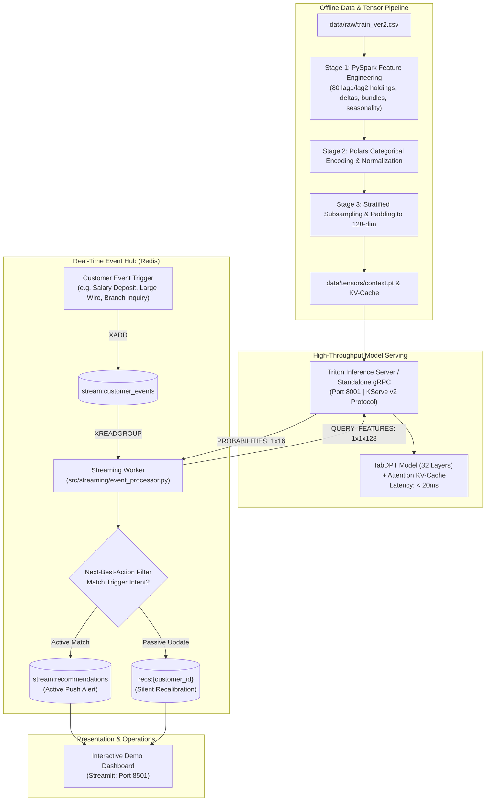

# TabDPT-reco: Real-Time Tabular Foundation Model Recommendation System

An end-to-end, event-driven banking recommendation platform powered by **TabDPT** (Tabular Deep Pretrained Transformer) on the Santander Product Recommendation ecosystem.

The system scales from raw multi-year transactional banking data (~2.4 GB) to low-latency real-time inference (<25ms) via **Triton Inference Server (gRPC)**, **Redis Streams**, and an executive **Streamlit Next-Best-Action Dashboard**.

---

## 🏛️ System Architecture


```mermaid
flowchart TD
    subgraph Offline["Offline Data & Tensor Pipeline"]
        direction TB
        raw["data/raw/train_ver2.csv"] --> S1["Stage 1: PySpark Feature Engineering<br/>(80 lag1/lag2 holdings, deltas, bundles, seasonality)"]
        S1 --> S2["Stage 2: Polars Categorical Encoding & Normalization"]
        S2 --> S3["Stage 3: Stratified Subsampling & Padding to 128-dim"]
        S3 --> Tensors["data/tensors/context.pt & KV-Cache"]
    end

    subgraph Serving["High-Throughput Model Serving"]
        direction TB
        Tensors --> Triton["Triton Inference Server / Standalone gRPC<br/>(Port 8001 | KServe v2 Protocol)"]
        Triton --> KV["TabDPT Model (32 Layers) + Attention KV-Cache<br/>Latency: < 20ms"]
    end

    subgraph Streaming["Real-Time Event Hub (Redis)"]
        direction TB
        UI_Action["Customer Event Trigger<br/>(e.g. Salary Deposit, Large Wire, Branch Inquiry)"] -->|XADD| StreamIn[("stream:customer_events")]
        StreamIn -->|XREADGROUP| Worker["Streaming Worker<br/>(src/streaming/event_processor.py)"]
        Worker -->|QUERY_FEATURES: 1x1x128| Triton
        Triton -->|PROBABILITIES: 1x16| Worker
        Worker --> NBA{"Next-Best-Action Filter<br/>Match Trigger Intent?"}
        NBA -->|Active Match| StreamOut[("stream:recommendations<br/>(Active Push Alert)")]
        NBA -->|Passive Update| Cache[("recs:{customer_id}<br/>(Silent Recalibration)")]
    end

    subgraph Client["Presentation & Operations"]
        direction TB
        StreamOut --> UI["Interactive Demo Dashboard<br/>(Streamlit: Port 8501)"]
        Cache --> UI
    end
```

---

## 📁 Repository Structure

```text
TabDPT-reco/
├── data/                               # Datasets, parquet partitions, & metadata
│   ├── raw/                            # Original Santander CSVs & compressed archives
│   ├── processed/                      # Intermediate Parquet partitions across stages
│   │   ├── train_clean/                # Cleaned training partition (< 2016-05-28)
│   │   ├── test_may2016_clean/         # Cleaned evaluation test partition (2016-05-28)
│   │   ├── features/                   # Engineered lag, delta, bundle & seasonal features
│   │   └── normalized_dataset.parquet  # Fully encoded & globally standardized dataset
│   ├── metadata/                       # Mappings & feature normalization stats
│   └── tensors/                        # Padded tensors & precomputed KV-cache
│       ├── context.pt                  # Padded feature matrix [N, 128], torch.bfloat16
│       ├── y.pt                        # Target class vector [N], torch.int64
│       └── context_kv_cache.pt         # Precomputed attention KV-cache for <20ms inference
├── model_repo/                         # Triton Inference Server Model Repository
│   └── tabdpt/
│       ├── config.pbtxt                # KServe v2 input/output schema [1, 1, 128] -> [1, 16]
│       └── 3/                          # Model version directory
├── src/                                # Core codebase
│   ├── config.py                       # Central configurations, paths, Redis settings & schemas
│   ├── run_pipeline.py                 # CLI runner for offline Stages 1, 2, and 3
│   ├── triton_grpc_server.py           # KServe v2-compliant Triton gRPC serving daemon (Port 8001)
│   ├── stages/                         # Offline pipeline stages
│   │   ├── stage1_spark_features.py    # PySpark cleaning & feature engineering
│   │   ├── stage2_encode_normalize.py  # Categorical encoding & global normalization
│   │   └── stage3_tensor_builder.py    # Stratified subsampling & 128-dim tensor builder
│   ├── streaming/                      # Real-time event streaming subsystem
│   │   ├── __init__.py
│   │   └── event_processor.py          # Redis Stream worker: consumes, predicts & publishes recos
│   └── frontend/                       # Interactive demonstration UI
│       ├── __init__.py
│       └── app.py                      # Streamlit real-time dashboard & action simulator
├── tests/                              # Unit & integration test suites
│   ├── test_triton_grpc.py             # Triton gRPC liveness & inference contract verification
│   └── test_kv_cache.py                # KV-cache consistency & speedup validation
├── deploy_to_vast.ps1                  # Remote deployment automation for Vast.ai GPU instances
├── requirements.txt                    # Project dependencies
└── README.md
```

---

## ⚡ Core Components

### 1. Offline Data & Feature Engineering Pipeline
- **Stage 1 (PySpark)**: Cleans demographics, imputes province median income, and engineers 80 predictive features including:
  - 24 product lag-1 holdings & 10 core product lag-2 holdings.
  - Acquisition/churn velocity deltas for core 7 products.
  - Composite bundle scores (`payroll`, `investment`, `credit`, `savings`).
  - Seasonality drivers (cyclical sine/cosine month encoders, tax, academic, summer, and pension windows).
  - 16-class product recommendation target ($0$ = do nothing, $1..15$ = new product acquired).
- **Stage 2 (Polars)**: Fast columnar categorical frequency encoding and global z-score normalization.
- **Stage 3 (Polars + PyTorch)**: Temporal stratified sampling (~100k balanced rows) and zero-padding features from 80 to **128 dimensions** (native width expected by TabDPT transformer layers).

### 2. Model Serving Layer (Triton gRPC)
- Standalone KServe v2 / Triton-compatible gRPC server listening on port **8001**.
- Model signature:
  - Input: `QUERY_FEATURES` [Batch, 1, 128] (FP32).
  - Output: `PROBABILITIES` [Batch, 16] (FP32).
- **KV-Cache Acceleration**: Leverages precomputed context key-value pairs (`context_kv_cache.pt`) to bypass re-encoding historical evaluation contexts, dropping inference latency from ~500ms to **< 20ms**.

### 3. Real-Time Streaming Subsystem (Redis Streams)
- **Ingestion (`stream:customer_events`)**: Durable event log capturing real-time user actions (`customer_id`, `action`, `timestamp`).
- **Consumer Group (`reco_workers`)**: `src/streaming/event_processor.py` reads events via `XREADGROUP`, extracts customer history, assembles normalized 128-dim tensors, queries Triton, and filters already-held products.
- **Next-Best-Action (NBA) Relevance Filter**:
  - Distinguishes between **Active Triggers** (e.g. `salary_deposit` matching `direct_debit` or `pensions`) and **Passive Updates** (e.g. routine `card_payment`).
  - Active matches fire push notifications to `stream:recommendations`.
  - Passive actions silently recalibrate the customer's cached profile in `recs:{customer_id}` with TTL.
- **Zero-Docker Rapid Dev Mode**: Includes built-in `fakeredis` support for instant in-memory development, with automatic toggle to real Redis/Docker (`USE_FAKE_REDIS=false`).

### 4. Interactive Demo Dashboard (Streamlit)
- **Live Archetype Dossiers**: Pre-loaded with diverse customer personas (e.g. Customer `1166753` — University Student, `658033` — Affluent Professional) displaying live held product badges and financial metadata.
- **Interactive Action Simulator**: One-click simulation of banking triggers (Salary Deposit, Capital Inflow > €10k, Branch Loan Inquiry, Tax Login, Card Payment).
- **Hero Recommendation Card**: Displays top recommended product with confidence score, category, and an **Active Trigger Match vs. Silent Profile Update** visual banner.
- **Full Class Propensity Distribution**: Real-time bar chart over all 15 product probabilities.
- **Redis Streams Audit Trail**: Real-time inspection of stream message IDs, payloads, and latency stats.

---

## 🚀 Quickstart Guide

### 1. Environment Setup

```bash
# Clone repository
git clone https://github.com/Ty-Tshiam/TabDPT-reco.git
cd TabDPT-reco

# Create and activate virtual environment
python -m venv .venv
source .venv/bin/activate  # On Windows: .venv\Scripts\activate

# Install dependencies
pip install -r requirements.txt
```

### 2. Running Offline Pipeline Stages (Optional)
If regenerating parquet partitions and PyTorch tensors from raw data:

```bash
# Run complete end-to-end pipeline (Stages 1 -> 2 -> 3)
python src/run_pipeline.py --stage all

# Or run individual stages:
python src/run_pipeline.py --stage 1  # PySpark cleaning & feature engineering
python src/run_pipeline.py --stage 2  # Categorical encoding & normalization
python src/run_pipeline.py --stage 3  # Stratified subsampling & 128-dim tensor export
```

### 3. Launching the Real-Time Stack

Run the following services in separate terminals:

#### Terminal 1: Model Serving (Triton gRPC Server)
```bash
python src/triton_grpc_server.py
```
*Listens on `localhost:8001` and initializes the TabDPT 32-layer transformer with KV-cache.*

#### Terminal 2: Streaming Consumer Worker
```bash
python src/streaming/event_processor.py
```
*Listens to `stream:customer_events`, runs Triton inference, applies Next-Best-Action filtering, and publishes recommendations.*

#### Terminal 3: Interactive Demo Frontend
```bash
streamlit run src/frontend/app.py
```
*Opens the executive demo dashboard at `http://localhost:8501`.*

---

## 🧪 Verification & Testing

Verify Triton gRPC server liveness, input/output tensors, and recommendation ranking:

```bash
# Test Triton gRPC connection & inference contract
python tests/test_triton_grpc.py

# Test KV-Cache consistency against full forward pass
python tests/test_kv_cache.py
```

---

## 🌐 Remote Deployment (Vast.ai)

To deploy heavy processing, Redis, or Triton serving on a remote GPU instance with Vast.ai:

```powershell
./deploy_to_vast.ps1 -HostIP "<instance-ip>" -Port "<ssh-port>"
```

This automated deployment script:
1. Clones the repository into `/workspace/TabDPT-reco`.
2. Sets up directory structures (`data/raw/`, `data/processed/`, `data/metadata/`, `data/tensors/`).
3. Securely copies compressed datasets and pre-cleaned partitions via SCP.
4. Installs headless Java JRE and Python dependencies into the remote environment.
