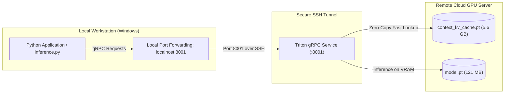

# TabDPT Triton gRPC Deployment Runbook

A guide for deploying, managing, and querying the TabDPT recommendation model on remote cloud GPU instances (Vast.ai, RunPod, Lambda Labs, etc.) via Triton gRPC.

---

## Architecture Overview



---

## 1. Renting a GPU Instance

When renting an instance on Vast.ai (or any cloud GPU provider):

* **Recommended GPUs:** NVIDIA GeForce RTX 3090 (24GB), RTX 4090 (24GB), RTX A5000 (24GB), or A6000 (48GB).
* **Disk Space:** Allocate at least **40 GB** of disk space (the context KV-cache is 5.6 GB, plus PyTorch and CUDA libraries).
* **Template:** Standard PyTorch template (e.g. `pytorch/pytorch` or Ubuntu 22.04 / 24.04 with CUDA 12+).
* **Connection Info:** Note the provided **Host IP** and **SSH Port** (e.g., `65.108.94.15` and `42749`).

---

## 2. One-Command Automated Deployment

To deploy to a fresh instance, simply run:

```powershell
.\deploy_to_vast.ps1
```

If prompted, enter your instance IP and SSH Port (or press `Enter` to accept the defaults).

Alternatively, pass them directly via command line:

```powershell
.\deploy_to_vast.ps1 -HostIP "65.108.94.15" -Port "42749"
```

### What the Script Automates:
1. **Tests SSH connectivity** and verifies GPU detection via `nvidia-smi`.
2. **Synchronizes project files** (source code, metadata JSONs, model configs, test scripts).
3. **Uploads core context tensors** (`context.pt` = 23 MB, `y.pt` = 715 KB).
4. **Bootstraps Python dependencies** (`huggingface_hub`, `safetensors`, `scipy`, `scikit-learn`, `omegaconf`, `tritonclient[grpc]`, `tmux`).
5. **Generates artifacts on the server NVMe** via `save_model.py`: downloads `Layer6/TabDPT` weights and pre-encodes the 5.6 GB KV-cache in ~15 seconds on the GPU.
6. **Launches the persistent gRPC server** in a detached `tmux` session on port `8001`.
7. **Establishes the local SSH tunnel** (`localhost:8001 -> remote:8001`) and executes `tests/test_triton_grpc.py` to confirm live inference!

---

## 3. Remote Server Management (`manage_remote_server.sh`)

A dedicated management script is installed at `/workspace/TabDPT-reco/scripts/manage_remote_server.sh`.

Run these commands from your local machine via SSH:

### Check Status & GPU Memory
```powershell
ssh -p <PORT> root@<HOST_IP> "bash /workspace/TabDPT-reco/scripts/manage_remote_server.sh status"
```
*Output: Process status, PID, CPU/Memory %, GPU name, VRAM used/total, and recent logs.*

### Live Server Logs
```powershell
ssh -p <PORT> root@<HOST_IP> "bash /workspace/TabDPT-reco/scripts/manage_remote_server.sh logs"
```

### Restart Server
```powershell
ssh -p <PORT> root@<HOST_IP> "bash /workspace/TabDPT-reco/scripts/manage_remote_server.sh restart"
```

### Stop Server
```powershell
ssh -p <PORT> root@<HOST_IP> "bash /workspace/TabDPT-reco/scripts/manage_remote_server.sh stop"
```

---

## 4. How to Query the API Locally

Once the SSH tunnel is active on `localhost:8001`, query the model with standard `tritonclient.grpc`:

```python
import numpy as np
import tritonclient.grpc as grpcclient

# Connect to local port (forwarded to GPU server)
client = grpcclient.InferenceServerClient(url="localhost:8001")

# Verify health
assert client.is_server_ready()
assert client.is_model_ready("tabdpt")

# Customer feature tensor: shape [Batch=1, Queries=1, Features=128], FP32
customer_features = np.random.randn(1, 1, 128).astype(np.float32)

# Pack request
inputs = [grpcclient.InferInput("QUERY_FEATURES", [1, 1, 128], "FP32")]
inputs[0].set_data_from_numpy(customer_features)
outputs = [grpcclient.InferRequestedOutput("PROBABILITIES")]

# Perform inference (sub-50ms)
response = client.infer(model_name="tabdpt", inputs=inputs, outputs=outputs)
probabilities = response.as_numpy("PROBABILITIES")  # Shape: (1, 16)

print("Predicted 16 product probabilities:\n", probabilities)
```

---

## 5. Troubleshooting & FAQ

### Tunnel Connection Refused (`10054` or `Connection refused`)
* The SSH tunnel may have closed. Re-establish it:
  ```powershell
  ssh -N -L 8001:localhost:8001 -p <PORT> root@<HOST_IP>
  ```

### Re-running Artifact Generation (`--force`)
* If training data changes or context tensors are updated, re-encode the KV-cache:
  ```powershell
  ssh -p <PORT> root@<HOST_IP> "cd /workspace/TabDPT-reco && /venv/main/bin/python src/save_model.py --force"
  ```
